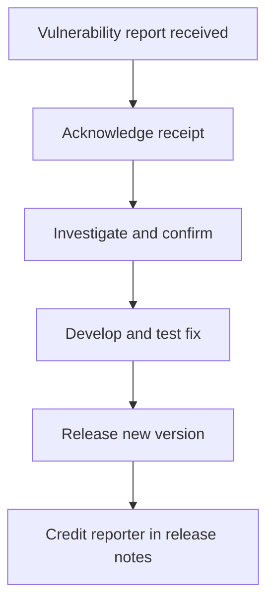

# Security Policy

## Reporting a Vulnerability

I take the security of this project seriously. If you believe you have found a security
vulnerability, please report it to me responsibly.

**Please do not report security vulnerabilities through public GitHub issues.**

Instead, use
[GitHub Private Vulnerability Reporting](https://docs.github.com/en/code-security/security-advisories/working-with-repository-security-advisories/configuring-private-vulnerability-reporting-for-a-repository)
via [Security Advisories](https://github.com/nikosavola/k-ruoka-mcp/security/advisories),
or contact @nikosavola directly.

### What to include in a report

- A description of the vulnerability and its potential impact.
- Steps to reproduce it. A minimal working example is highly appreciated.
- Any mitigations you have identified.

## What matters most in this project

Two areas carry more weight than the rest, so findings there are especially welcome.

### The browser profile is a credential

`~/.local/share/k-ruoka-mcp/profile` (or `K_RUOKA_PROFILE`) holds a live K-Plussa session.
Anything that could expose, copy or leak it is a real vulnerability. So is anything that
deletes it, since the login is the only thing there and re-creating it needs a human.

The profile is created mode `0700` and no code path in this repository deletes files. A
Cloudflare block deliberately relaunches the browser against the *same* directory rather
than clearing it.

### Injection into the in-page fetch

Every API call is executed as JavaScript inside the loaded page, so the method, path and
body are interpolated into a script. They are JSON-escaped at each point, and there is a
hostile-input test covering it. A way past that escaping would be a genuine finding.

## Out of scope

- **That the tool automates a private API.** That is the design, and the trade-offs are
  documented in the README. It is not a vulnerability report.
- **That K-Ruoka's API changed and something broke.** Please open a normal issue.
- Findings in Chrome, `chromiumoxide`, or K-Ruoka's own service. Report those upstream.

## Process

